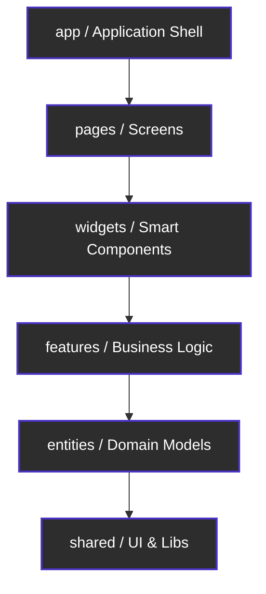

# OfflineFirst Local Notes


OfflineFirst Local Notes is a privacy-focused, incredibly fast note-taking application designed to keep your data strictly on your device. Without relying on any cloud services or backend servers, it offers zero-latency performance and ensures your notes are never shared over the internet. You can securely export your notes to an AES-256 encrypted backup file and restore them whenever needed. 

Built with React Native and TypeScript, this project serves as a showcase of modern, scalable frontend architecture known as Feature-Sliced Design (FSD).

## Architecture

This project strictly adheres to the Feature-Sliced Design (FSD) methodology to maintain clean layer boundaries and prevent tightly coupled code.

### Architecture Diagram


### Key Architectural Decisions
- No backend, no cloud: 100% offline, your data stays entirely on your device.
- MMKV for storage: JSI-based storage which is significantly faster than standard AsyncStorage.
- AES-256-GCM encryption: Military-grade security for your local backup files.
- Feature-Sliced Design: Strict unidirectional dependency rules preventing spaghetti code.

## Tech Stack
| Layer | Technology |
|-------|-----------|
| Framework | React Native CLI |
| Language | TypeScript (strict mode) |
| Storage | react-native-mmkv |
| Crypto | react-native-quick-crypto (AES-256-GCM) |
| Navigation | React Navigation 7 |
| Architecture | Feature-Sliced Design |

## 📥 How to Download & Run

### For Regular Users

Currently, this application is not published on the App Store or Google Play Store. To use it on your device without building from source, you would typically need a pre-built package:
- **Android**: You can install the `.apk` file (if provided in the [Releases](https://github.com/) section of this repository). Ensure you allow "Install from Unknown Sources" in your device settings.
- **iOS**: Currently, there is no direct download available for iOS users. Apple's ecosystem does not permit direct installations (.apk style) without an Apple Developer Account or TestFlight configuration. Since this project was developed for personal use and portfolio showcase, iOS public distribution is not configured at this stage but may be added in future updates.

### For Developers (Build from Source)

**Prerequisites:**
- Node.js (v22+)
- A Mac computer (strictly required if you want to build for iOS)
- Xcode (for iOS) and Android Studio (for Android)

**1. Clone and Install Dependencies**
```bash
git clone https://github.com/yourusername/OfflineFirstLocalNotes.git
cd OfflineFirstLocalNotes
npm install
```

**2. iOS Setup (Mac Only)**
```bash
cd ios
pod install
cd ..
npx react-native run-ios
```
*Note: To run on a physical iPhone, open the `ios/OfflineFirstLocalNotes.xcworkspace` in Xcode, configure your Apple ID in the "Signing & Capabilities" tab, and select your connected iPhone as the run destination.*

**3. Android Setup**
```bash
npx react-native run-android
```
*Note: To generate a release APK for Android, run `./gradlew assembleRelease` inside the `android/` directory.*

## Project Structure (FSD)

- app/ : Application bootstrap, routing, and global setup
- pages/ : Top-level screens integrating widgets and features
- widgets/ : Smart components combining entities and features
- features/ : Business logic slices (e.g., add-note, edit-note, backup-vault)
- entities/ : Domain models and repositories (e.g., note, category)
- shared/ : Reusable primitives, crypto libraries, storage adapters, design tokens

## Screenshots

<div align="center">
  
  &nbsp;
  
  &nbsp;
  
</div>

## Security

All backups are encrypted locally using AES-256-GCM with a user-provided password before leaving the device. The password is never stored or transmitted anywhere.

## License
MIT
