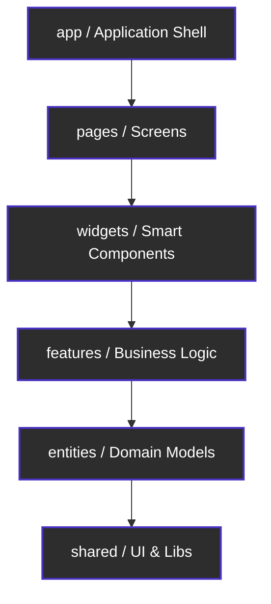

# Secret (OfflineFirst Local Notes)


**Secret** is a privacy-focused, lightning-fast note-taking application for Android and iOS. It keeps your data strictly on your device with zero cloud dependency, zero network calls, and zero third-party data collection. You can securely export your notes to an AES-256 encrypted backup file and restore them at any time.

Built with React Native and TypeScript, this project follows the **Feature-Sliced Design (FSD)** architecture — a scalable, maintainable frontend methodology that enforces strict layer boundaries and unidirectional dependency rules.

## Screenshots

<div align="center">
  
  &nbsp;
  
  &nbsp;
  
</div>

---

## Table of Contents

- [Key Features](#key-features)
- [App Screens](#app-screens)
- [Architecture](#architecture)
- [Tech Stack](#tech-stack)
- [Project Structure](#project-structure)
- [Data Model](#data-model)
- [Storage Strategy](#storage-strategy)
- [Security & Encryption](#security--encryption)
- [Design System](#design-system)
- [How to Download & Run](#how-to-download--run)
- [Troubleshooting](#troubleshooting)
- [License](#license)

---

## Key Features

### Offline-First, Privacy-First
- **100% Offline:** No backend, no cloud, no analytics. All data is persisted locally on the device using MMKV.
- **No Network Permissions:** The app does not request internet permission. Your notes never leave your phone.

### Note Management
- **Quick Capture:** Dedicated Capture tab for instantly creating notes with a title, content body, and category assignment.
- **Rich Note Cards:** Each note displays its title, content preview (up to 120 characters), category badge with color indicator, pin status, and favorite status.
- **Swipe-to-Delete:** Native horizontal swipe gesture on each note card reveals a delete button. Includes a confirmation alert before deletion.
- **Pin & Favorite:** Notes can be pinned to always appear at the top of the list, or favorited for quick identification.
- **Word & Character Counter:** Real-time word and character count displayed at the bottom of the note editor.
- **Auto-Title Extraction:** If no title is provided, the first line of the content (up to 50 characters) is automatically used as the title.

### Category System
- **Hierarchical Categories:** Full support for parent-child (multi-level) category trees. Create categories and nest unlimited subcategories under them.
- **Color-Coded:** Each category is automatically assigned a unique color from a curated palette. This color appears as a left border on note cards for instant visual identification.
- **Category Filtering:** In the Vault, a horizontal category filter bar lets you tap any category to instantly filter notes. Selecting a parent category also shows notes from all its subcategories.
- **Long-Press to Delete:** Categories can be deleted by long-pressing them — both in the Vault filter bar and inside the Category Manager in Settings.
- **Inline Creation:** New categories and subcategories can be created inline without leaving the current screen. A `+` button appears next to a selected category to add a subcategory beneath it.

### Search
- **Full-Text Search:** The Vault includes a search bar that filters notes in real-time by matching the query against both the title and content of every note (case-insensitive).

### Encrypted Backups
- **Export:** All notes and categories are serialized to JSON, then encrypted with AES-256-CBC using a user-provided password, and saved as a `.json` file. The system share sheet is presented so you can send the file anywhere (email, cloud drive, etc.).
- **Import:** Pick an encrypted backup file from your device, enter the password, and all notes and categories are restored. A confirmation dialog warns that importing will overwrite all current data.
- **Password Dialog:** A dedicated modal with a secure text input field, loading spinner, and cancel/confirm buttons handles password entry for both export and import flows.

### Navigation
- **Instagram-Style Swipeable Tabs:** The three main screens (Capture, Vault, Settings) are arranged in a Material Top Tab Navigator positioned at the bottom, powered by `react-native-pager-view`. Users can swipe horizontally between tabs just like Instagram.
- **Vault Stack Navigator:** The Vault tab has its own nested stack navigator, allowing you to push the Edit Note page on top of the Vault list and navigate back with a clean transition.

### Settings
- **Native Settings UI:** The Settings tab is designed to look like a real iOS/Android settings menu with grouped card sections, labeled rows, icons, and chevron indicators for actionable items.
- **Vault Details Section:** Displays live statistics — total categories (tappable, opens Category Manager), total notes, total word count, and last update time (relative format).
- **Data Management Section:** Contains Export and Import rows styled consistently with the rest of the settings menu.
- **Category Manager Modal:** A full-screen modal (slide-up animation) that displays the entire category hierarchy. You can add new root categories, add subcategories under any selected category, and delete categories via long-press.

### Date & Sorting
- **Sort by Creation Date:** Notes are sorted by `createdAt` timestamp in descending order (newest first) by default.
- **Dual Timestamps on Cards:** The creation date is always shown on the bottom-right of each note card. If the note has been edited (title or content changed), an italic "Edited X ago" timestamp appears on the bottom-left.
- **Smart Timestamp Updates:** Only title or content changes update the `updatedAt` field. Category changes, pin toggles, and favorite toggles do not modify the timestamp.

---

## App Screens

### Capture
The landing screen. A clean, full-height editor with a title field and a multiline content area. The header shows "Secret Note" on the left and a "Save" button on the right. Tapping Save opens a Category Selection Modal where you can assign a category before confirming. A word/character counter sits at the bottom.

### Vault
The note browser. A "Your notes" header is followed by a search bar, a horizontal category filter strip, and a vertically scrollable list of note cards. Each card supports horizontal swipe-to-reveal-delete. Tapping a card navigates to the Edit Note page. An empty state with an icon and helpful text is shown when no notes match the current filters.

### Edit Note
A full-screen editor pre-populated with the selected note's title and content. Includes a back button (arrow with frame), a "Save" button, a category selector, and a delete button. Word and character counts update in real-time.

### Settings (Preferences)
A scrollable settings menu with two grouped sections:
- **Vault Details** — Manage Categories (with count, tappable), Total Notes, Total Words, Last Updated
- **Data Management** — Export Encrypted Backup, Import Encrypted Backup

---

## Architecture

This project strictly follows **Feature-Sliced Design (FSD)**, a scalable frontend architecture methodology. Each layer has a clear responsibility and can only depend on layers below it.

### Architecture Diagram


### Layer Responsibilities

| Layer | Responsibility | Example |
|-------|---------------|---------|
| **app** | Bootstrap, providers, root navigation | `App.tsx`, `RootNavigator.tsx` |
| **pages** | Screen-level composition of widgets | `CapturePage`, `VaultPage`, `SettingsPage`, `EditNotePage` |
| **widgets** | Smart, stateful UI blocks combining features & entities | `NoteList`, `CategoryFilter`, `SearchBar`, `CategoryManagerModal` |
| **features** | User-facing business logic slices | `add-note`, `edit-note`, `backup-vault` |
| **entities** | Domain models, repositories, pure helpers | `note` (CRUD, sorting, formatting), `category` (CRUD, hierarchy) |
| **shared** | Reusable primitives with zero business logic | `Button`, `Card`, `Icon`, `SettingsRow`, `EmptyState`, `Divider`, MMKV adapter, crypto service, design tokens |

---

## Tech Stack

| Layer | Technology | Purpose |
|-------|-----------|---------|
| Framework | React Native CLI 0.85 | Cross-platform native app |
| Language | TypeScript (strict mode) | Type safety across the entire codebase |
| Storage | react-native-mmkv v4 | JSI-based key-value storage, ~30x faster than AsyncStorage |
| Crypto | crypto-js (AES-256-CBC) | Pure JS encryption, maximum stability, no native build issues |
| Navigation | React Navigation 7 | Material Top Tabs (swipeable) + Native Stack |
| Pager | react-native-pager-view | Native swipe between tabs |
| Icons | react-native-vector-icons | MaterialCommunityIcons icon set |
| File System | react-native-fs | Read/write backup files to device storage |
| Share | react-native-share | Native OS share sheet for exporting backups |
| Document Picker | @react-native-documents/picker | File selection for importing backups |

---

## Project Structure

```
src/
├── app/                           # Application shell
│   ├── App.tsx                    # Root component, providers, initialization
│   ├── navigation/
│   │   ├── RootNavigator.tsx      # Material Top Tab Navigator (bottom position)
│   │   ├── VaultStack.tsx         # Nested stack navigator for Vault → EditNote
│   │   └── types.ts              # Navigation type definitions
│   └── providers/
│       └── ErrorBoundary.tsx      # Global error boundary
│
├── pages/                         # Screen-level components
│   ├── capture/ui/CapturePage.tsx  # Note creation screen
│   ├── vault/ui/VaultPage.tsx     # Note browsing screen
│   ├── edit-note/ui/EditNotePage.tsx # Note editing screen
│   └── settings/ui/SettingsPage.tsx # Preferences & data management
│
├── widgets/                       # Smart composed components
│   ├── note-list/
│   │   ├── ui/NoteList.tsx        # FlatList + ScrollView swipe-to-delete
│   │   └── components/NoteCard.tsx # Individual note card UI
│   ├── category-filter/
│   │   └── ui/CategoryFilter.tsx  # Horizontal category chip strip
│   ├── category-manager/
│   │   └── ui/CategoryManagerModal.tsx # Full-screen category CRUD modal
│   ├── search-bar/
│   │   └── ui/SearchBar.tsx       # Search input with clear button
│   └── note-stats/
│       └── ui/NoteStats.tsx       # Vault statistics display
│
├── features/                      # Business logic slices
│   ├── add-note/
│   │   ├── components/
│   │   │   ├── AddNoteForm.tsx    # Title + content editor with save flow
│   │   │   ├── CategoryPicker.tsx # Hierarchical category tree with CRUD
│   │   │   ├── CategorySelectionModal.tsx # Modal wrapper for CategoryPicker
│   │   │   └── CharacterCounter.tsx # Word + char count display
│   │   └── model/
│   │       └── useAddNote.ts      # Hook: form state, validation, save logic
│   ├── edit-note/
│   │   ├── components/
│   │   │   └── EditNoteForm.tsx   # Pre-populated editor with back/delete
│   │   └── model/
│   │       └── useEditNote.ts     # Hook: load, update, delete note
│   └── backup-vault/
│       ├── components/
│       │   ├── ExportBackupButton.tsx # Export action row
│       │   ├── ImportBackupButton.tsx # Import action row with warning
│       │   └── PasswordDialog.tsx # Secure password input modal
│       └── model/
│           ├── useExportBackup.ts # Hook: serialize → encrypt → share
│           ├── useImportBackup.ts # Hook: pick file → decrypt → restore
│           └── types.ts          # BackupData, EncryptedBackupFile types
│
├── entities/                      # Domain models & data access
│   ├── note/
│   │   ├── api/noteRepository.ts  # MMKV CRUD: create, read, update, delete, search, export, import
│   │   ├── model/types.ts         # Note, CreateNoteDTO, UpdateNoteDTO, sort types
│   │   └── lib/noteHelpers.ts     # UUID generation, title extraction, sorting, relative time, word count
│   └── category/
│       ├── api/categoryRepository.ts # MMKV CRUD: create, read, update, delete, reorder, export, import
│       ├── model/types.ts         # Category, CreateCategoryDTO, UpdateCategoryDTO
│       └── lib/categoryHelpers.ts # ID generation, color palette rotation
│
└── shared/                        # Zero-business-logic primitives
    ├── config/
    │   └── theme.ts               # Full design token system (colors, spacing, typography, shadows, etc.)
    ├── lib/
    │   ├── mmkv-storage/
    │   │   ├── storage.ts         # IStorageAdapter implementation over MMKV
    │   │   └── types.ts           # IStorageAdapter interface
    │   └── crypto-lib/
    │       ├── crypto.ts          # AES-256-CBC encrypt/decrypt via crypto-js
    │       ├── types.ts           # EncryptedPayload, ICryptoService interface
    │       └── __tests__/         # Crypto unit tests
    └── ui/
        ├── Button.tsx             # Primary/secondary/ghost variants
        ├── Card.tsx               # Surface container with border & shadow
        ├── Icon.tsx               # MaterialCommunityIcons wrapper
        ├── Divider.tsx            # Horizontal line separator
        ├── EmptyState.tsx         # Icon + title + subtitle placeholder
        └── SettingsRow.tsx        # iOS/Android-style settings menu row
```

---

## Data Model

### Note
| Field | Type | Description |
|-------|------|-------------|
| `id` | `string` | UUID v4 (generated via `Math.random`) |
| `title` | `string` | User-provided or auto-extracted from first line |
| `content` | `string` | Full plaintext content |
| `categoryId` | `string?` | Optional reference to a Category |
| `createdAt` | `number` | Unix timestamp (ms) — never changes after creation |
| `updatedAt` | `number` | Unix timestamp (ms) — updates only on title/content change |
| `isFavorite` | `boolean` | Starred status |
| `isPinned` | `boolean` | Pinned to top of list |

### Category
| Field | Type | Description |
|-------|------|-------------|
| `id` | `string` | UUID v4 |
| `name` | `string` | Display name |
| `color` | `string` | Hex color (auto-assigned from palette) |
| `icon` | `string?` | Optional emoji icon |
| `sortOrder` | `number` | Position in the list |
| `createdAt` | `number` | Unix timestamp (ms) |
| `parentId` | `string?` | Parent category ID (for hierarchical nesting) |

---

## Storage Strategy

All data is persisted via **react-native-mmkv** — a JSI-based (JavaScript Interface) storage engine that communicates directly with C++ without crossing the JS bridge, making it approximately **30x faster than AsyncStorage**.

### Key Schema
```
note:{uuid}        → JSON string (single Note object)
note:__index__     → JSON string (string[] of all note IDs)
category:{uuid}    → JSON string (single Category object)
category:__index__ → JSON string (string[] of all category IDs)
app:initialized    → boolean
```

### Performance Characteristics
- **Single note read/write:** O(1) — direct key lookup via MMKV.
- **List all notes:** O(n) — read index array, then map each ID to its stored JSON.
- **Search:** O(n) — linear scan with `String.includes()` over title and content.

---

## Security & Encryption

### Backup Encryption Flow
```
User Password
     │
     ▼
PBKDF2-SHA256 (100,000 iterations, 16-byte random salt)
     │
     ▼
256-bit Derived Key
     │
     ▼
AES-256-CBC Encrypt (16-byte random IV, PKCS7 padding)
     │
     ▼
EncryptedPayload { ciphertext, iv, salt, algorithm, version }
     │
     ▼
Wrapped in EncryptedBackupFile { type, version, payload, exportedAt }
     │
     ▼
Written to .json file → Shared via OS Share Sheet
```

### Key Details
- **Algorithm:** AES-256-CBC via `crypto-js` (pure JavaScript — no native module build issues)
- **Key Derivation:** PBKDF2 with SHA-256, 100,000 iterations, 16-byte random salt
- **IV:** 16 bytes, randomly generated per encryption operation
- **Output:** Base64-encoded ciphertext, IV, and salt stored in a structured JSON payload
- **Password:** Never stored or transmitted. Losing the password means permanent loss of the backup data.

---

## Design System

All visual constants are defined in a single source of truth: `shared/config/theme.ts`.

### Color Palette (Corporate Dark Theme)
| Token | Value | Usage |
|-------|-------|-------|
| `background` | `#121212` | Main app background |
| `surface` | `#1E1E1E` | Cards, modals, tab bar |
| `surfaceElevated` | `#252525` | Hover/focus states |
| `primary` | `#F5F5F5` | Primary text and active elements |
| `textSecondary` | `#8A8A8A` | Muted text |
| `textDisabled` | `#5A5A5A` | Placeholders |
| `border` | `#2A2A2A` | Dividers and borders |
| `accent` | `#BB86FC` | Accent highlights |
| `error` | `#CF6679` | Destructive actions, swipe-to-delete |
| `success` | `#4CAF50` | Success states |

### Spacing Scale
4 / 8 / 16 / 24 / 32 / 48 (xs / sm / md / lg / xl / xxl)

### Typography
- **H1:** 28px, bold — Page titles
- **H2:** 20px, semibold — Section headings, card titles
- **Body:** 17px, line-height 26 — Content text
- **Caption:** 12px — Timestamps, counters
- **Eyebrow:** 11px, bold, uppercase, letter-spacing 1.4 — Labels

### Animation Timings
- **Fast:** 150ms — Button presses, micro-interactions
- **Normal:** 300ms — Modal transitions
- **Slow:** 500ms — Onboarding reveals

---

## How to Download & Run

### For Regular Users

Currently, this application is not published on the App Store or Google Play Store.
- **Android:** Install the `.apk` file from the [Releases](https://github.com/) section. Enable "Install from Unknown Sources" in your device settings.
- **iOS:** No direct download available. Requires building from source with an Apple Developer Account.

### For Developers (Build from Source)

**Prerequisites:**
- Node.js (v22+)
- A Mac computer (required for iOS builds)
- Xcode (for iOS) and Android Studio (for Android)

**1. Clone and Install Dependencies**
```bash
git clone https://github.com/yourusername/OfflineFirstLocalNotes.git
cd OfflineFirstLocalNotes
npm install
```

**2. iOS Setup (Mac Only)**
```bash
cd ios
pod install
cd ..
npx react-native run-ios
```
*To run on a physical iPhone, open `ios/OfflineFirstLocalNotes.xcworkspace` in Xcode, configure your Apple ID under "Signing & Capabilities", and select your device.*

**3. Android Setup**
```bash
npx react-native run-android
```
*To generate a release APK, run `./gradlew assembleRelease` inside the `android/` directory.*

---

## Troubleshooting

### 1. "Gradle requires JVM 17 or later to run" Error
- **Cause:** Your system is using an older Java version.
- **Solution:** Install Microsoft OpenJDK 17. Update your `JAVA_HOME` environment variable to point to the new JDK 17 installation path.

### 2. "'adb' is not recognized as an internal or external command" Error
- **Cause:** Android SDK platform tools are not in your system's PATH.
- **Solution:** Add `C:\Users\<YourUsername>\AppData\Local\Android\Sdk\platform-tools` to your Windows Environment Variables.

### 3. Device Not Showing in 'adb devices'
- Go to **Settings > About Phone**, tap **"Build Number"** 7 times to enable Developer Options.
- Under **Developer Options**, enable **"USB Debugging"**.
- Reconnect USB and tap **"Allow"** on the authorization prompt.

### 4. "Filename longer than 260 characters" (Windows Build Error)
- **Cause:** Windows has a 260-character path limit. Deep `node_modules` paths can exceed this during C++ compilation.
- **Solution:** Enable long paths in Windows Registry:
  ```powershell
  New-ItemProperty -Path 'HKLM:\SYSTEM\CurrentControlSet\Control\FileSystem' -Name 'LongPathsEnabled' -Value 1 -PropertyType DWORD -Force
  ```
  Alternatively, create a directory junction to shorten the project path:
  ```cmd
  mklink /J C:\N C:\Users\YourName\WebstormProjects\OfflineFirstLocalNotes
  cd C:\N\android && gradlew assembleRelease
  ```

---

## License
MIT
